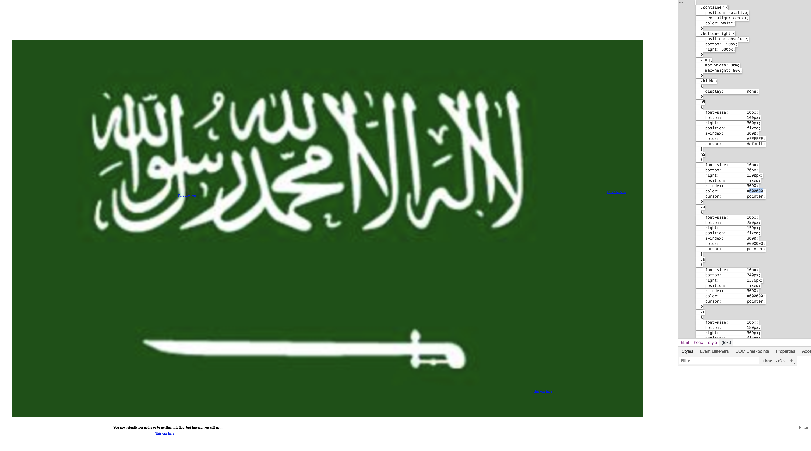
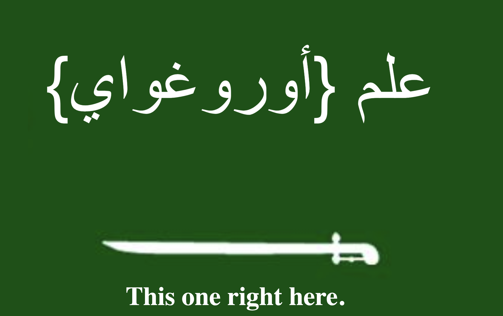

<h1>April Fools</h1>
<h2>Summary</h2>
The user is provided with a webpage showing the recently released version of the exclusive edition of the Saudi Flag, or so it says. The user must attempt to find out if the webpage and the supposed deal is true and justifiable or if it is actually a phishy webpage and a fraudulent deal. Depending on what the user thinks, they either put in the flag provided for them if they think the webpage and deal is real or they will attempt to find the hidden flag if they think the deal isn't what it says it really is.
<h2>Hint</h2>
Not everything is as it seems, some of the most secret things are done in open spaces and in public.
<h2>Solution</h2>
The user is suppose to find out that the deal is a deal not the deal that it says that it is. They are then suppose to inspect elements to webpage in order to find the hidden material on the webpage. They can then go and change the color of the hidden text in order to click on it and find hidden links on the webpage, or they could go through the program and access the hidden links that way as well.
 
 

 
 
After trying a few of the links, they will get to the correct link and find a weird-looking Saudi flag.
 
 

 
 
 They are suppose to notice that the text on the topic of the flag is weird. They are suppose to realize that the top portion of the flag with the text contains that flag. Then they translate what is on the top of the flag from Arabic to English to find the <b>flag{Uruguay}</b>.
  
  
  
 
<b>For more information, please contact me:
  Joseph Zhong
  Email: jszhong2003@gmail.com</b>

