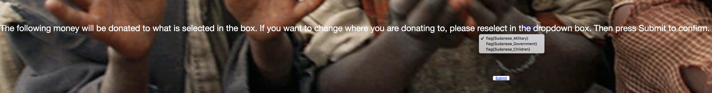

<h1>Caring Heart</h1>
<h2>Summary</h2>

This is a phishy website challenge in which the user is trying to find out what is wrong with the website and where all the money is really going instead of being donated to children in Sudan.

<h2>Hint</h2>
There are Hidden elements on every page including the hidden page.
<h2>Solution</h2>

Inspect element->Body Class->Div->h5(which states onclick hide, revealing hidden content)->double click on the text to type something into the onclick hide and type things in. 

Clicking on this on the webpage will show you the hidden elements giving you three options for a flag.

Reading the instructions, which state that in order for you to change to location of your donation, you must reselect then hit submit.
<

But when you hit submit, you are taken to a hidden webpage that says you cannot change the location of where you donate your money to thus leaving it at the default option which is <b>flag{Sudanese_Military}</b>. Meaning that there is the location of where your money is going and thus there is your flag.

