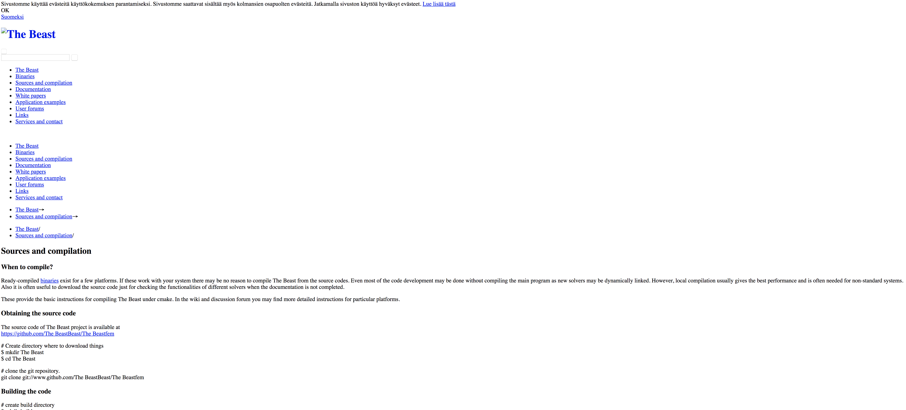
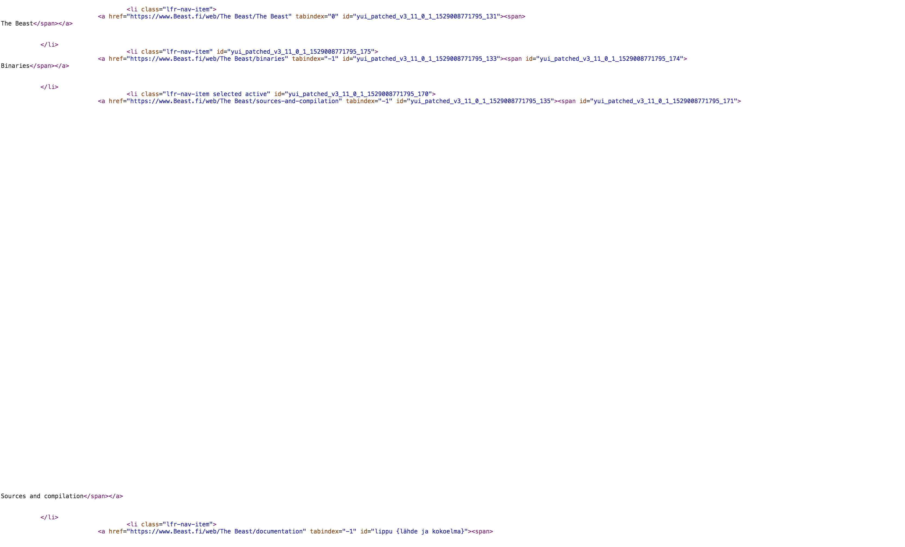

<h1>The Finnish Trick</h1>
<h2>Summary</h2>
The user is given a webpage that looks very much corrupted to the core.
 
 

 
 
The user is told that the flag is hidden somewhere on the webpage even though the webpage looks like it was corrupted and someone made a bunch of messy and hasty changes to it. The user is also told to fix or attempt to fix the webpage in order to get the flag which appears to be in Finnish.
<h2>Hint</h2>
Lippu is the Finnish word for flag.
<h2>Solution</h2>
The user is suppose to inspect element and find the source code for the file. They are then suppose to go check on the index.html to see what is wrong with the code that made the webpage this way.
 
 

 
 
While they're doing this, they will notice that the whole code is in English except for an abnormality with one specific ID of something looking like Finnish. They translate the Finnish text to English text and they get their <b>flag{source_and_collection}</b>.
 
 
 

<b>For more information, please contact me:
 Joseph Zhong
 Email: jszhong2003@gmail.com</b>

