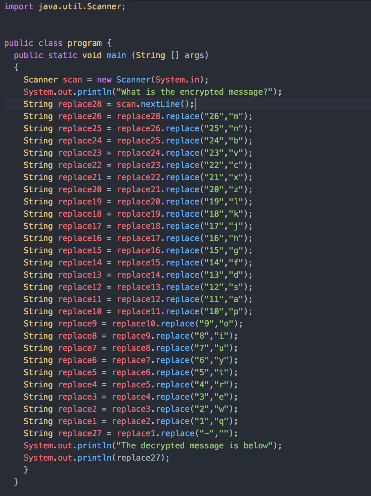

<h1>History Lesson</h1>
<h2>Summary</h2>
The user is given a encrypted text file to decode and find the flag within.
<h2>Hint</h2>
Your piano is your keyboard.
<h2>Solution</h2>
The idea is for the user to figure out that the code is based on the position of the key on your keyboard. Then either code a program to find the answer or if they don't know how to, use their physical keyboard and find the answer. After translating the whole thing into readable English, it shouldn't be very hard to find the <b>flag{fear}</b> from there.
<h2>A Sample Solution</h2>

