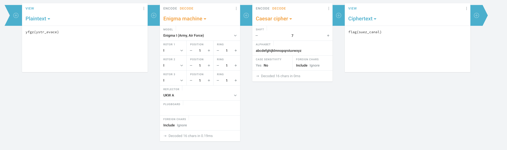

<h1>Invasion?</h1>
<h2>Summary</h2>

The user is given a clues about the how the people encrypted the message, and is given the encrypted message. The user then has to decrypt the encrypted message and then read the message to find the flag, the location of their supposed first attack.

<h2>Hint</h2>
The Italian Ceaser's Cipher.
<h2>Solution</h2>

The solution is that the user must first decrypt the encrypted message with the Engima Machine, then decrypt it with the Ceaser's Cipher, which they will find through trial and error is set to a rotation by seven letters. They will then get the <b>flag{suez_canal}</b>.
<h2>Sample Solution</h2>

 
 
 

<b>For more information, please contact me:
 Joseph Zhong
 Email: jszhong2003@gmail.com</b>

