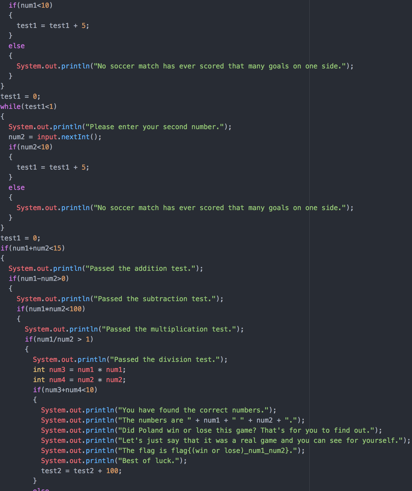

<h1>Soccer</h1>
<h2>Summary</h2>
The user is given a compiled java program. They are then told that by using the program, that they will get the score of a soccer game and the flag.
<h2>Hint</h2>
The game was between Poland and an African Nation.
<h2>Solution</h2>
The user has two choices in order to solve this problem:
<h6>Choice 1</h6>
The first choice the user could take is decompiling the program. They can then access the source code and look at the direct coding of the program. What they will find will be a bunch of conditions that two numbers must match in order for it to be the score of the game.
 
 

 
 
They can then either solve it out by hand or build a program to find the two numbers depending on their programming skill level. Once they find the score of the game, they can then look up the score of the game in order to find if Poland lost or won the game.
 
 

 
 
Since both games that Poland has played in with the score 2-1 Poland has lost, and the flag formatting is given in the program, this should lead them to <b>flag{lose_2_1}</b>.
<h6>Choice 2</h6>
The other choice the user could take is just running the actual java program. This would be a trial and error process in order to find the two numbers that fit just right for the program. After they find which numbers work, they can also look up the score of the game to find if Poland won or lost the game.
 
 

 
 
Since both games that Poland has played in with the score 2-1 Poland has lost, and the flag formatting is given in the program, this should lead them to  <b>flag{lose_2_1}</b>.
